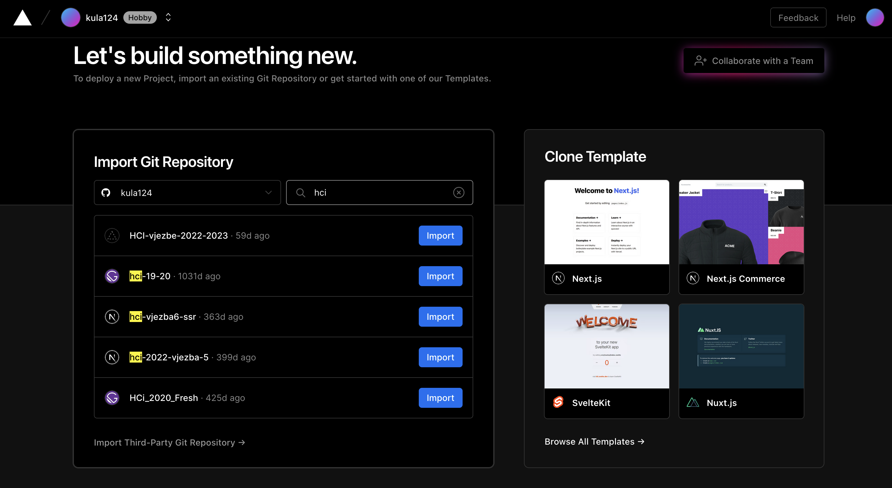
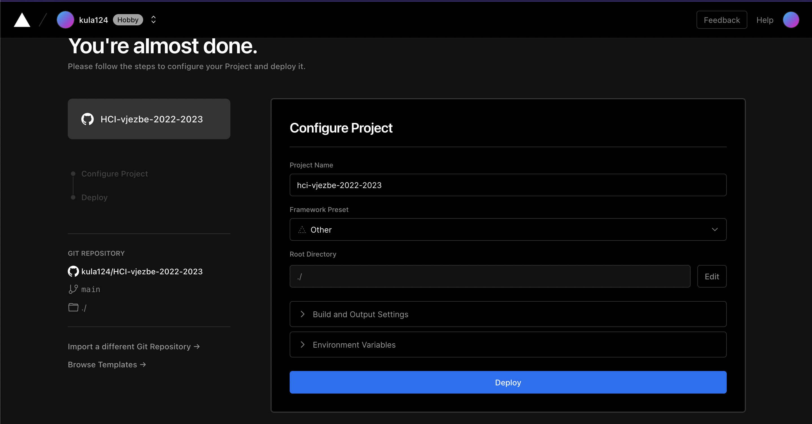

# HCI-vježbe-2022-2023

## Vježba 7: Next Image and deploy

U zadnjoj vježbi demonstrirat ćemo kako radi i čemu služi Next Image i kako objaviti stranicu jednom kad je gotova.

### Next Image

> ⚠️ Next 13 mijenja API kojim se koristi NextImage, ali principi rada i prednosti ostaju.

`<Image />` koji smo već viđali do sad donosi prednosti nad običnim `` tagom.
Neke od prednosti uključuju:

-   **Brže učitavanje stranice**: slike Next.js učitavat će se samo pri ulasku u okvir za prikaz, a prema zadanim se postavkama učitavaju odgođeno.
-   **Responzivnost**: slikama će se promijeniti veličina u skladu s korištenim uređajem.
-   **Vizualna stabilnost**: automatski se izbjegava problem kumulativne promjene izgleda. [Više ovdje](https://web.dev/cls/)
-   **Poboljšana izvedba**: Next.js slike mogu se mijenjati u veličini i kodirati na zahtjev, čak i kada su pohranjene na udaljenim poslužiteljima ili vanjskom izvoru podataka, kao što je CMS. To vas sprječava da morate stvarati slike različitih veličina tijekom izrade, što ga čini bržim.

### Korištenje

Za početak potreban je import:

```jsx
import Image from 'next/image';
```

Sljedeće što NextImage treba je `src` atribut koji može biti:

1. Statički importana sika
2. Relativna putanja na sliku u `public` folderu (primjeri u dosadašnjim vježbama)
3. URL na sliku na internetu ili CMS-u / CDN-u

Primjeri:

1. Primjer statične slike:

```jsx
import fooImage from '../public/assets/foo.jpg';
```

i onda

```jsx
<>
    {/*// ...*/}
    <Image
        src={fooImage}
        alt="Foo image"
        layout={'fill'}
        // ...
    />
    {/*// ...*/}
</>
```

2. Primjer za relativnu putanju na sliku u `public`:

```jsx
<Image src={'/assets/hero.png'} alt="Foo image" layout={'fill'} />
```

3. Primjer za URL:

```jsx
<Image
    src={'https://assets-global.website-files.com/neka_slika.jpg'}
    alt="Foo image"
    layout={'fill'}
/>
```

Ono što je bitno za javne slike je postavljanje whitelist domena za te slike.

Iz sigurnosnih razloga Next ne dopušta da samo stavimo URL na sliku nego je potrebno i dodati domenu te slike u listu dopuštenih domena (tkz. whitelist)

Ako pogledamo u `next.config.js` možemo vidit definirane domene koje smo koristili na vježbama:

```js
module.exports = {
    reactStrictMode: true,
    images: {
        remotePatterns: [
            {
                protocol: 'https',
                hostname: 'assets-global.website-files.com',
            },
            {
                protocol: 'https',
                hostname: 'i.ytimg.com',
            },
            {
                protocol: 'https',
                hostname: 'play-lh.googleusercontent.com',
            },
            {
                protocol: 'https',
                hostname: 'pbs.twimg.com',
            },
            {
                protocol: 'https',
                hostname: 'scrimba.com',
            },
        ],
    },
};
```

Ako koristitmo `<Image />` na Nextu 13 ne trebamo `layout` prop.

## Deploy

Za deploy koristit ćemo **Vercel**! Platformu tvoraca Next-a. Alternativno, možemo koristiti **Netlify**, privatni VPS ili RasberyPI (extra bodovi za ovo 😁).

Deploy ćemo radit pomoću GitHub-a. Svaki novi push u `main` branch aktivirat će ponovni deploy.  
Deploy korak radi build Next aplikacije i objavljuje stranicu javno. Spajanje tog koraka na GitHub primjer je automatizacije deploxa koja se još zove i **Continuous Deployment**

Započetak registrirajmo se na Vercel koristeći Github Account:
https://vercel.com

Zatim idemo na stvaranje novog projekta i biramo naš repo.

<p align='center'>
  
</p>

Zatim na koraku možemo postaviti konfiguraciju. Za sada nam ne treba:

<p align='center'>
  
</p>

> ✅ Commit  
> `git add .`  
> `git commit -m "Vjezba 6: List all posts"`
